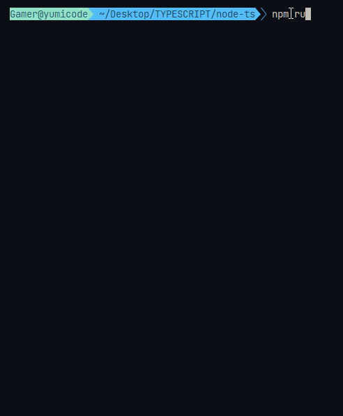
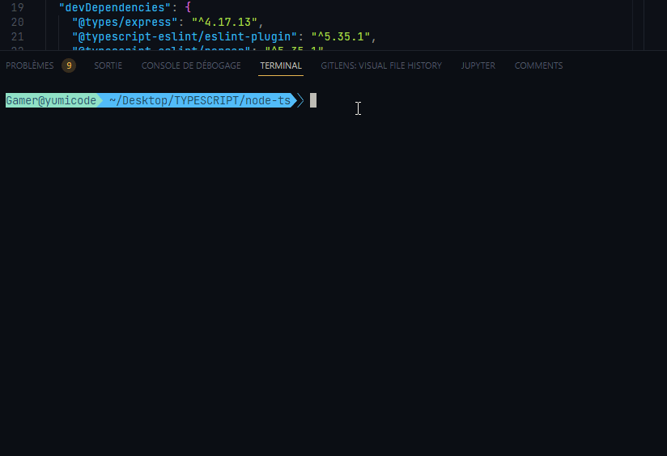

# Node & Typescript : First steps

## Introduction

[Node](https://nodejs.org/en/) is a run-time environment that makes it possible to write server-side JavaScript.

[TypeScript](https://www.typescriptlang.org/) is a super-set of JavaScript, which means that all JavaScript code is valid TypeScript code.

## How to start ?

First, create a new folder and then, initialize the project

```sh
npm init -y
```

And install the package

```sh
npm i --save-dev typescript
```

## Configure the compiler

Create a file named `tsconfig.json`

And paste the following JSON

```js
{
  "compilerOptions": {
    "module": "ES6",
    "esModuleInterop": true,
    "target": "es6",
    "moduleResolution": "node",
    "sourceMap": true,
    "outDir": "dist"
  },
  "lib": ["es2015"]
}
```

`module`: Specifies the module code generation method.

`target`: Specifies the output language level.

`moduleResolution`: This helps the compiler figure out what an import refers to. The value node mimics the Node module resolution mechanism.

`outDir`: This is the location to output .js files after transpilation. In this tutorial you will save it as dist.

The `outDir` can specify where the file will be savec once compiled/

If not specified, .js files will be ine the same directory as .ts files

```js
$ tsc
example
├── index.js
└── index.ts

```

But with outDir configuration

```js
example
├── dist
│   └── index.js
├── index.ts
└── tsconfig.json
```

## Create a mini TypeScript Express server

Add the Express framework and Express types for Typescript support

```sh
npm i express
npm i --save-dev @types/express

```

Types in TypeScript are files, normally with an extension of `.d.ts`. The files are used to provide type information about an API, in this case the Express framework.

This package is required because TypeScript and Express are independent packages. Without the @types/express package, there is no way for TypeScript to know about the types of Express classes.

## Configure entrypoint

Create your first file `app.ts` in a src folder

```js
//~Dotenv
import 'dotenv/config';

//~ Import modules
import express from 'express';
const app = express();
//~ Import Debug
import debug from 'debug';
const logger = debug('EntryPoint');

//^TEST ONE ROUTE FOR TS
app.get('/', (req, res) => {
  res.send('Hello world!');
});

//~ Launch Server
const PORT = process.env.PORT ?? 3000;

app.listen(PORT, () => {
  logger(`🚀\x1b[1;35m Launch server on http://localhost:${PORT}\x1b[0m`);
});
```

And configure your package.json file

```js
  "scripts": {
    "start": "node dist/app.js",
    "dev": "nodemon dist/app.js"
  },
```

And you can launch the server

```sh
npm run dev
```

## Configure Typescript Linting with eslint

```sh
npm i -D eslint
```

Run it to configure eslint

```sh
npx eslint --init

or

npm init @eslint/config
```

Launch linter

```sh
npx eslint . --ext .ts
```

This will ask you a series of questions. For this project we’ll answer the following:

- _How would you like to use ESLint?_ : To check syntax and find problems

- _What type of modules does your project use?_ : JavaScript modules (import/export)

- _Which framework does your project use?_ : None of these

- _Does your project use TypeScript?_ : Yes

- _Where does your code run?_ : Node

- _What format do you want your config file to be in?_ : JavaScript

- Finally, you will be prompted to install some additioanl eslint libraries. Choose Yes.

eslint configuration file 

```js
module.exports = {
    "env": {
        "node": true,
        "es2021": true
    },
    "extends": [
        "eslint:recommended",
        "plugin:@typescript-eslint/recommended"
    ],
    "overrides": [
    ],
    "parser": "@typescript-eslint/parser",
    "parserOptions": {
        "ecmaVersion": "latest",
        "sourceType": "module"
    },
    "plugins": [
        "@typescript-eslint"
    ],
    "rules": {
    }
}

```

parser: this tells ESLint to run the code through a parser when analyzing the code
parserOptions: specifies what JS language options you want to support, such as the version of ECMAScript syntax you want to use
plugins: this is where you define plugins to use
extends: tells ESLint what configuration is set to extend from. The order matters, as the last extend option will override the previous ones in any conflicting configurations
env: which environments your code will run in

## Auto compiling TypeScript on save

Configure package.json

```js
  "scripts": {
    "start": "tsc && node dist/app.js",
    "dev": "nodemon dist/app.js",
    "tsc":"tsc -w",
    "lint": "eslint . --ext .ts"
  },
```

Add in tsconfig.json file

```js
{
    "compilerOptions": {
      "module": "ES6",
      "esModuleInterop": true,
      "target": "es6",
      "moduleResolution": "node",
      "sourceMap": true,
      "outDir": "dist"
    },
    "lib": ["es2015"],
    "compileOnSave": true // THIS LINE
  }
```

### FIRST SOLUTION

Open 2 terminal command line

In the first one

```sh
npm run tsc
```

In the second

```sh
npm run dev
```

In the third

```sh
npm run lint
```

## SECOND ONE (chosen)

Use package npm `concurrently` to launch both at the same time

In package.json file

```js
  "scripts": {
    "start:build": "tsc -w",
    "start:run": "nodemon dist/app.js",
    "start:lint": "eslint . --ext .ts",
    "watch": "concurrently npm:start:*"
  },
```

And launch

```sh
npm run watch
```

And now you have everything connected : live compiling and running eslint for Typescript



# BONUS

And some configuration and colors later...



---

Sources

[TUTO](https://www.digitalocean.com/community/tutorials/setting-up-a-node-project-with-typescript)

[Compiler options](https://www.typescriptlang.org/docs/handbook/compiler-options.html)

[TS config](https://www.typescriptlang.org/tsconfig)
